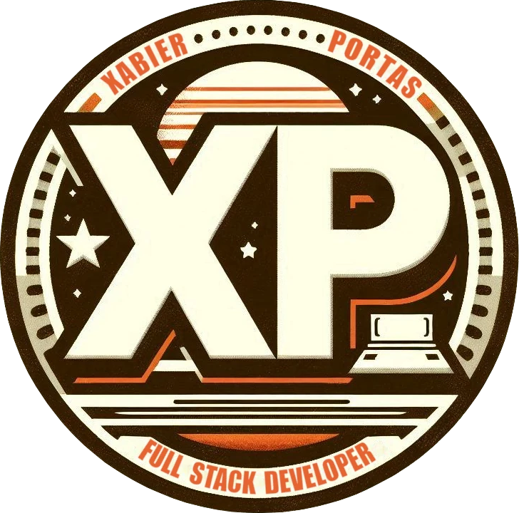
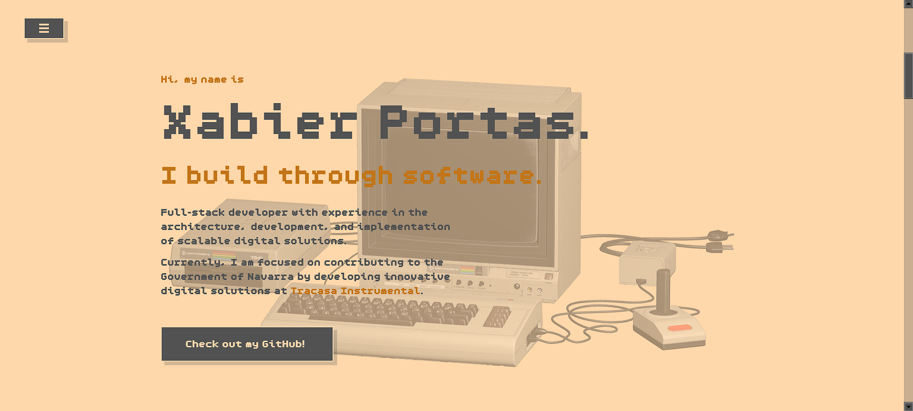

<div align="center">
  
</div>
<h1 align="center">
  xportas retro website
</h1>
<p align="center">
  An open-source project containing the source code of my personal website.
</p>
<p align="center">
  This project was created using the following technologies:
  <ul>
    <li><strong>Next.js</strong> and <strong>React</strong>: Used for building the website.</li>
    <li><strong>Three.js</strong>: Utilized for rendering the 3D model on the website.</li>
    <li><strong>Tailwind CSS</strong>: Employed for styling the website.</li>
    <li><strong>Other</strong>: the basics, CSS, HTML and JavaScript, to take design, customization and user experience to another level.
  </ul>
</p>



## 🚨 Forking this repo (please read!)

Since I embarked on the development of this project, it was clear to me that it was going to be open source because I owe it to the community. Whenever I needed it, I found in it the collaboration and generosity that has helped me grow as a developer. This project has taken me countless hours of work and I have learned a lot in the process. Now, I want to return the favor and do my part to keep the community alive.

That said, while I love it when people use, learn from or even get inspired by my work, plagiarism is not okay. If you want to reuse any part of this project, I only ask that you give me proper credit by linking back to [xabierportas.dev](https://xabierportas.dev). This project is the result of a lot of effort and dedication, and I simply want that work to be recognized.

Thanks for understanding and I hope you enjoy finding all the easter eggs that I have left along this long and tortuous path😊

## 🛠 Installation & Set Up

1. Install the required npm packages and dependencies and then, run the project

```bash
npm install

```

```bash
npm run dev

```
2. Open [http://localhost:3000](http://localhost:3000) and let your journey into the past begin!